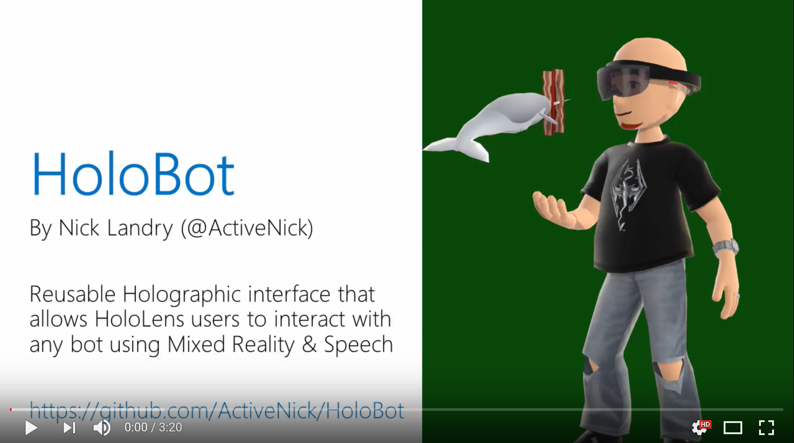
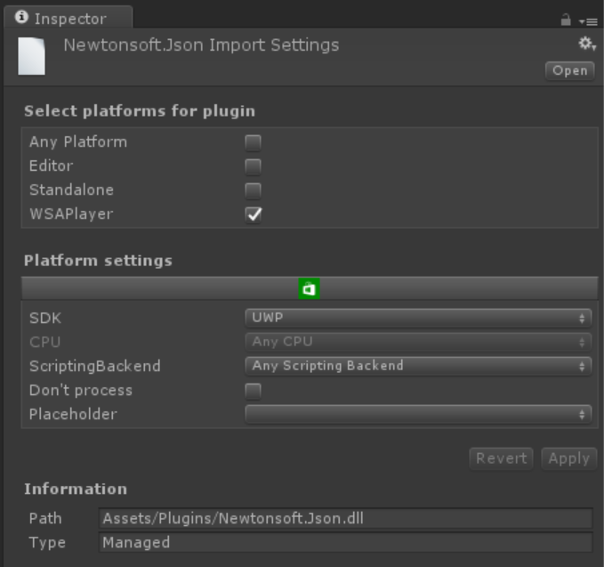
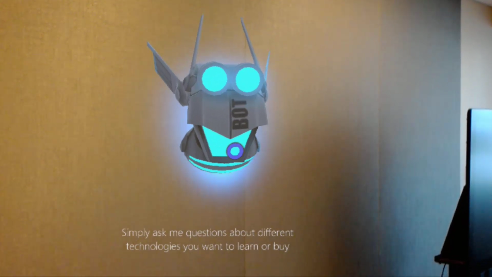

# HoloBot
Take your bots beyond Skype, Teams and Facebook and bring them into the real world with Mixed Reality. Why simply type-chat with a bot when you could actually look at them, talk to them and listen to their answers?

HoloBot is a reusable Windows Mixed Reality Unity project for [Microsoft HoloLens](http://hololens.com) that lets you interact with a floating robot head using speech recognition, and getting answers spoken back by the "bot" using Text-to-Speech. The commands sent to the bot are powered by the [Microsoft Bot Framework](https://dev.botframework.com/) and [LUIS](https://www.microsoft.com/cognitive-services/en-us/language-understanding-intelligent-service-luis) from [Microsoft Cognitive Services](https://www.microsoft.com/cognitive-services).

To get started with HoloLens development, visit the [Windows Holographic Dev Center](https://aka.ms/mr). The HoloLens Developer Kit is available for sale at http://hololens.com.

## Features
- Hovering bot head (aka HoloBot) with looping ambient sound.
- Tap the HoloBot to move it to a different location, tap again to place.
- Gaze at the HoloBot to trigger the speech recognizer, you will hear a "Ping" sound.
- Speak "commands" to HoloBot using natural language.
- The HoloBot speaks back to you using Speech Synthesis (aka Text-to-Speech, or TTS).
- All sounds and speech use spatial sound that originate from the HoloBot.
- The "brain" of the HoloBot can be any public bot built with the [Microsoft Bot Framework](https://dev.botframework.com/). Build your Bot using C# or Node. See bot integration instructions below.

## Video Demonstration

The bot demonstrated in this video is [The Maker Show Bot, also found here on GitHub](https://github.com/ActiveNick/TheMakerShowBot).

## Instructions / Notes
- The HoloBot model and sounds come from the [Holographic Academy](https://developer.microsoft.com/en-us/windows/holographic/academy) tutorial: [Holograms 240: Sharing Holograms].(https://developer.microsoft.com/en-us/windows/holographic/holograms_240)
- Uses Gaze Manager & Gesture Manager from [HoloLens Unity Toolkit](https://github.com/microsoft/HoloToolkit-Unity) (Input scripts).
- Uses Text to Speech Manager from [HoloLens Unity Toolkit](https://github.com/microsoft/HoloToolkit-Unity) (Utilities scripts).
- HoloBot still uses an older version of the HoloToolkit for Unity from September 2016. This will be upgraded to the latest version soon.
- Make sure to copy a UWP build of **Newtonsoft.Json.dll** in the **/Plugins** folder of the HoloBot Unity project.
- Edit the Inspector settings for the **Newtonsoft.Json.dll** plugin as follows:

## Connecting your Bot to HoloBot
- Create and register your bot as per the intructions at https://dev.botframework.com. Bots can be built with C# & ASP.NET WebAPI or Javascript & Node.js. Since HoloBot uses free natural language dictation, it is highly recommended that your bot support NLP via [Natural Language Understanding Service](https://www.microsoft.com/cognitive-services/en-us/language-understanding-intelligent-service-luis) (LUIS) from [Microsoft Cognitive Services](https://www.microsoft.com/cognitive-services)
- From the Bot Connector portal, enable the Direct Line channel on your bot
- Generate and copy your Direct Line secret (aka API key)
- Open **BotService.cs** in the **/Scripts** folder of the HoloBot Unity project and paste your Direct Line secret in the **_APIKEY** private string

## Acknowledgments
I want to offer special thanks to the following people who have helped me in building this sample app:
- [Jarez Bienz](https://github.com/jbienzms), for the Text-to-Speech component that he wrote the the HoloLens Unity Toolkit, and for his help in integrating my UWP Bot Framework code into Unity
- [Kat Haris](https://github.com/KatVHarris), for her awesome Unity skills and helping me with audio sources triggers
- Vanessa Arnauld & Sara Nagy, for being incredible holographic "enablers" :)
- The whole Microsoft Holographic Academy team & mentors - especially Pat - for their awesome training, resources, patience and help

## Follow Me
* Twitter: [@ActiveNick](http://twitter.com/ActiveNick)
* Blog: [AgeofMobility.com](http://AgeofMobility.com)
* SlideShare: [http://www.slideshare.net/ActiveNick](http://www.slideshare.net/ActiveNick)
